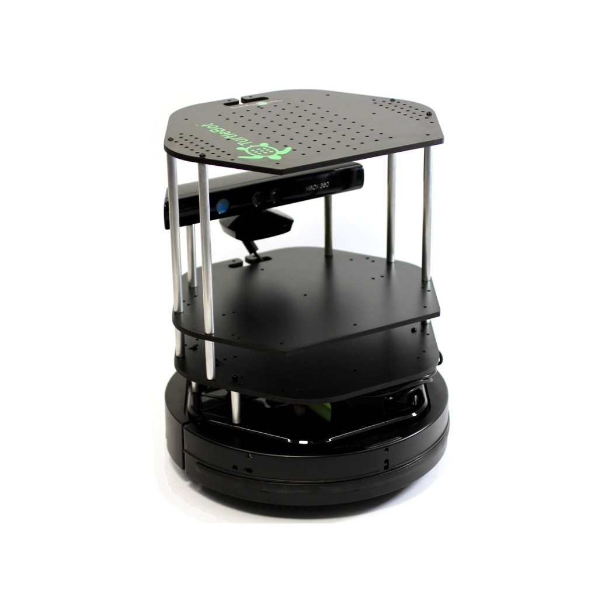
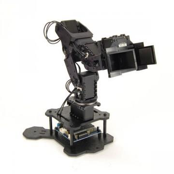
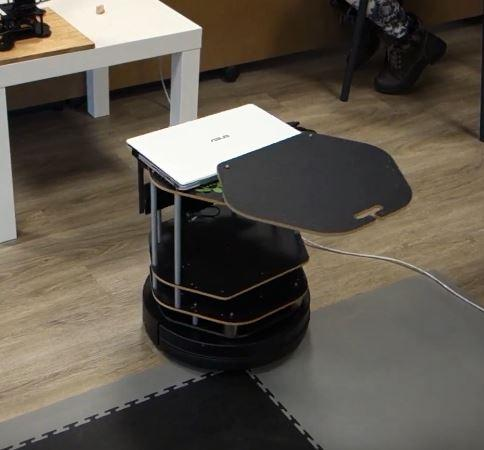
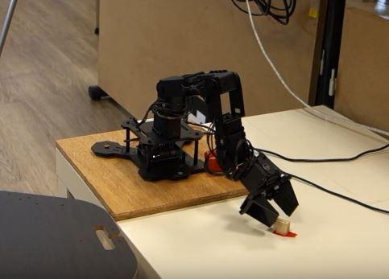
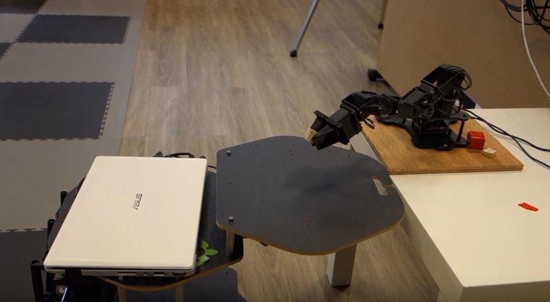

Damien Leroux  
Lisa Poirier  
Bachelors in Computer Vision

# Technical Report - Robotics Engineering Project

# Introduction

This project is about the cooperative task between two robots, a Turtlebot 2 and a PhantomX Pincher Robot Arm. We will lay out what packages and commands have been used for our scenario.

 
_Figure 0: The Turtlebot_

 
_Figure 1: The PhantomX Pincher Robot Arm_

The scenario unfolds as follows:

1. Teleoperated navigation of the Turtlebot and mapping of the room

1. Automated displacement of the Turtlebot to the table with obstacle avoidance

1. Retrieval of an object supplied by the robotic arm

1. Automated displacement of the Turtlebot to another location with obstacle avoidance

# Table of contents

Part one: Turtlebot
1. Controller
  1. Joy2Twist Package
  2. Why not turtlebot_teleop?

2. Mapping
  1. Launch Files
3. navigation
  1. Launch Files
  1. Assign a goal
  1. Obstacle avoidance
  1. Problems encountered

Part Two: Robotic arm
1. First impressions
  1. Arbotix_GUI
  2. Problems encountered
2. Building the scene
  1. Python script
  1. Time threshold
3. Executing the scenario
    1. Launch Files
Conclusion
Links to videos

## Part One: Turtlebot

You can find a detailed date-by-date progress log for this part in the file titled "Progress Report"

### 1. Controller

#### a. Joy2Twist Package

To create the map, we had to control the Turtlebot manually. We used the `joy2twist` package. This way, we could control the Turtlebot with the joysticks of the available Logitech controller. But we had an issue: the Turtlebot was moving dangerously fast. Not only that but the accelerations and decelerations were way to abrupt.

First, we divided the maximum speed of the robot by three, in our script titled `j2t.py`.

Secondly, we made smooth displacements by editing the `joy2twist_turtlebot.launch` file and adding a parameter line that ẁould repeat the last input on its own according to a fixed rate. We chose a frequency of 10 Hertz

`<param name="autorepeat_rate" value="10.0"/>`

In this way, we could control the Turtlebot with the joysticks, at a secure speed and with smooth controls.

#### b. Why not turtlebot_teleop?

In the Technical Survey, we chose to use the turtlebot_teleop package. We decided not to use it because of difficulties we've encountered. Thus, it was easier to solve the aforementioned issues with controls on our own package. Moreover, this last allows us to use the joysticks of the controller by default, contrary to the turtlebot_teleop package.

### 2. Mapping
#### a. Launch Files

As we wrote in the Technical Survey, for this part, we followed the
[ROS wiki tutorial](http://wiki.ros.org/turtlebot_navigation/Tutorials/indigo/Build%20a%20map%20with%20SLAM)
for map building. We created a new package on the workstation and created a launch file for mapping, which runs our joy2twist script as well as real-time visualisation, with Rviz. The same thing was done on the robot. This file runs the Lidar, which helps us detect and thus map the room, as well as a pre-existing mapping demo launch file, `gmapping_demo.launch`

The resulting map is them saved using :
`rosrun map_server map_saver -f map.`

### 3. Navigation

#### a. Launch Files

As with the mapping, we followed a
[ROS wiki tutorial](http://wiki.ros.org/turtlebot_navigation/Tutorials/indigo/Autonomously%20navigate%20in%20a%20known%20map)
for autonomous navigation as well. On our dedicated package, we created a launch file for navigation. The same thing was done on the turtlebot. For the robot to move on its own, we needed to bring up the Lidar, once again, as well as, `amcl_demo.launch`, which is a pre-made demo for autonoumous navigation and we needed to load the map we had previously generated.

#### b. Send a goal

When our visualisation program Rviz is open, we should see a turtlebot on our map. However, its position on the software might not be reflective of its actual position, in this case, we can ajust it.

A goal can be sent to the robot using the "2D Nav Goal" button. A position and an orientation must then be chosen.

#### c. Obstacle Avoidance

To make the Turtlebot avoiding obstacles during the autonomous navigation, we have to edit some parameters in the file `turtlebot_navigation/param/costmap_common_params.yaml`, on the Turtlebot computer. We have changed these values :

* obstacle_range : 3.0
* raytrace_range : 3.0
* min_obstacle_height : 0.25
* max_ obstacle_height : 1.00

This way, the Turtlebot creates a new path to reach its destination when it detects an obstacle.

####
d. Encountered problems

If the turtlebot's goal is too close to a obstacle, the robot essentially has to avoid while moving forward to reach to destination. Thus, it will spin around until reaching the desired position. To eliviate part of this problem we installed a tray at the front of the robot.

 
_Figure 2: The Turtlebot equiped with a tray_
## Part Two: Robot Arm

You can find a detailed date-by-date progress log for this part in the file titled "Progress Report".

### 1. First impressions
#### a. Arbotix_GUI

This command is a pretty intuitive way to start working with the robotic arm. It allows us to control each motor of the arm independently. This way, if the arm does not work properly, we could detect in which part of the arm the problem is.

#### b. Encountered problems

Sometimes, the arm would simply stop responding to our queries. Then, thanks to the arbotix_gui controller, we detected which part of the arm was breaking the connexion between the computer and the robot. We suspected that the cables had bad contacts. Then the teachers helped us to change some cables and that is how this problem has been solved.

### 2. Building the scene
#### a. Python files

A python file existed by default to give the arm a scene to execute. We used this file as a blueprint to create our own scene. We put the maximum number of attemps at 1, we changed the initial and final position of the cube (figure 3 and 4), we brought the level of the table down a bit, and we deleted object we didn't need for the scenario.

 
_Figure 3 : The robotic arm picks an object from a predetermined position_

The gripper accepted to pick and place a cube of a size between 0.003 and 0.007, but our cube had a size of 0.018. Anything outside of that threshold would be pick but not placed. After a lot of research, the only solution we found was to cut the cube to the appropriate size.

#### b. Time threshold

From time to time, movements would fail because the arm couldn't execute them within the assigned time threshold.
So, to eliviate this issue, we edited configurations to give the arm some leeway.

### 3. Executing the scene

#### a. Launch Files
We created a dedicated launch file for operations on the cube, in the same package we used so far.It brings up the arm, opens Rviz for real-time visualisation and executes our pick and place script.

## Conclusion
The scenario is respected : After creating a map of the room, the Turtlebot is able to navigate autonomously to a given goal all the while avoiding obstacles. Then, the arm is capable of taking a cube and placing it on the Turtlebot. Then we will give to the Turtlebot a new goal in the room, to finish our scenario.

This project about the cooperative task between two robots, a Turtlebot 2 and a PhantomX Pincher Robot Arm, is a success, as you can see in figure 4.

 
_Figure 4 : The robot arm is placing the cube above the Turtlebot_

## Videos
Videos:
[Turtlebot Mapping video](https://youtu.be/_PqXJa9cUQ4)
[Turtlebot Navigation video](https://youtu.be/qbWrYlB7TzE)
